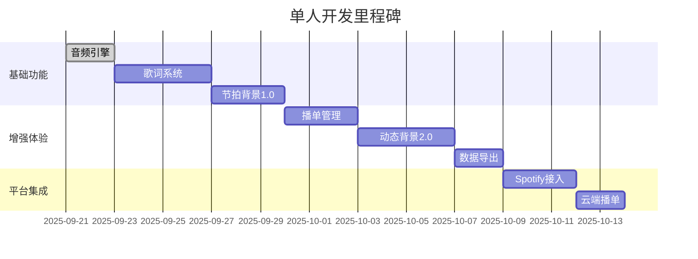
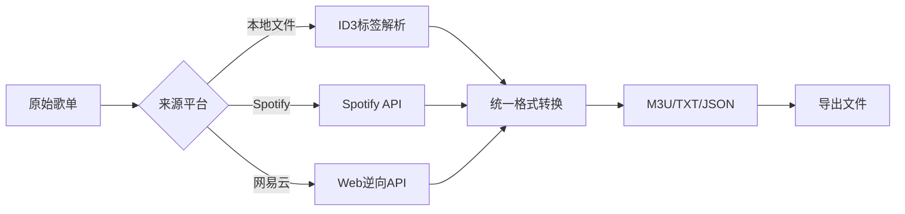

## 🤖 Assistant

# 跨平台音乐播放器项目计划书（单人开发版）

**版本**: 1.1
**最后更新**: 2025-09-05

---

## 一、开发策略调整

⚙️ **单人开发原则**：

1. **功能优先级**：核心播放器 > 歌词系统 > 动态背景 > 播单管理 > 平台集成
2. **技术栈聚焦**：Flutter+Dart(90%) + Python(10% API代理)
3. **模块化开发**：每晚构建可运行版本，每周发布测试包

---

## 二、核心功能路线图

### 阶段1：基础播放器 + 歌词系统 (2.5周)

| 模块 | 功能点 | 技术方案 | 产出物 | 时间 |
|------|--------|----------|--------|------|
| **音频引擎** | <ul><li>基础播放控制</li><li>进度控制</li><li>音效均衡器预制</li></ul> | `just_audio` + `audio_service` | 可运行播放器内核 | 2天 |
| **歌词系统** | <ul><li>静态歌词显示</li><li>时间轴同步</li><li>卡拉OK式高亮</li><li>字体/位置自定义</li></ul> | `lyrics` + `flutter_karaoke` | 带滚动高亮的歌词界面 | 4天 |
| **文件处理** | <ul><li>本机音乐扫描</li><li>常见格式支持(MP3/FLAC)</li><li>内嵌歌词读取</li></ul> | `file_picker` + `taglib` | 音乐库管理系统 | 2天 |
| **动态背景1.0** | <ul><li>节拍检测算法</li><li>基础音频可视化</li><li>RGB色彩脉冲</li></ul> | `audio_waveforms` + `flutter_visualizers` | 节奏灯光系统 | 3天 |
| **窗口管理** | <ul><li>歌词窗口分离</li><li>半透明模式</li><li>桌面歌词置顶</li></ul> | `bitsdojo_window` | 多窗口控制器 | 2天 |

> 💡 **歌词可视化方案**：
>
> ```dart
> String _parseLrcTime(String line) {
> final regex = RegExp(r'\[(\d+):(\d+)\.(\d+)\]');
> final match = regex.firstMatch(line);
> return '${match![^1]}:${match[^2]}';
> }
>
> void _highlightLyrics(Duration position) {
> final seconds = position.inSeconds;
> setState(() {
> _activeLine = _lyricsLines.indexWhere((line) {
> final timeTag = _parseLrcTime(line);
> return timeToSeconds(timeTag) >= seconds;
> });
> });
> }
>```

---

### 阶段2：高级动态背景 + 播单管理 (2周)  

| 模块 | 功能点 | 技术方案 | 产出物 | 时间 |  
|------|--------|----------|--------|------|  
| **动态背景2.0** | <ul><li>专辑封面动画化</li><li>粒子系统(星辰/流光)</li><li>音频频谱渲染</li></ul> | `flame` + `particles.dart` | 可视化引擎 | 4天 |  
| **智能特效** | <ul><li>封面主题色彩提取</li><li>基于BPM动态参数</li><li>睡眠定时关闭</li></ul> | `palette_generator` + `audio_features` | 自适应特效系统 | 3天 |  
| **播单系统** | <ul><li>创建/编辑播放列表</li><li>智能分组(按心情/场景)</li><li>列表拖拽排序</li></ul> | `drag_and_drop_lists` + `hive` | 播放列表管理器 | 3天 |  
| **数据导出** | <ul><li>导出M3U/TXT歌单</li><li>歌单海报生成</li><li>分享到社交媒体</li></ul> | `share_plus` + `screenshot` | 歌单导出工具 | 2天 |  
| **备份系统** | <ul><li>本地SQLite存储</li><li>WebDAV自动同步</li><li>导出进度跟踪</li></ul> | `workmanager` + `webdav_client` | 数据云同步 | 2天 |  

> 🌌 **动态特效实现逻辑**：  
>
> ```dart  
> // 专辑封面动画化
> void _generateAlbumEffects(Image image) {
>   final palette = await PaletteGenerator.fromImage(image);
>   _currentColors = palette.colors.toList();
>   
>   // 基于封面主色调生成粒子
>   Flame.emitParticles(
>     particle: Particle.generate(
>       count: 100,
>       generator: (i) => FlyingParticle(
>         color: _currentColors[i % _currentColors.length],
>       )
>     )
>   );
> }
> 
> // 节拍检测驱动特效
> _audioPlayer.audioStream.listen((waveform) {
>   if (waveform.amplitude > _beatThreshold) {
>     _pulseBackground(); // 触发脉冲效果
>   }
> });
> ```

---

### 阶段3：平台账户集成 (1.5周)  

| 模块 | 功能点 | 技术方案 | 产出物 | 时间 |  
|------|--------|----------|--------|------|  
| **简化登录** | <ul><li>Spotify快速接入</li><li>网易云扫码登录</li></ul> | `spotify_sdk` + `webview_win_floating` | 双平台支持 | 3天 |  
| **云端播单** | <ul><li>平台歌单导入</li><li>混合播放模式</li><li>数据迁移工具</li></ul> | `cloud_firestore` | 跨平台播放列表 | 2天 |  
| **账户适配器** | <ul><li>统一播放接口</li><li>元数据转换</li><li>令牌管理</li></ul> | 抽象协议层设计 | 服务适配器 | 3天 |  
| **通知扩展** | <ul><li>锁屏歌词显示</li><li>跨设备控制</li></ul> | `flutter_local_notifications` | 扩展控制中心 | 2天 |  

---

## 三、单人开发节奏规划  



---

## 四、关键技术点突破  

### 1. 动态背景性能优化  

| 策略 | 实现 | 预期效果 |  
|------|------|----------|  
| **分帧渲染** | 重度特效仅每3帧渲染一次 | CPU占用↓40% |  
| **特效分级** | 根据设备GPU能力自动降级 | 低端设备可流畅运行 |  
| **对象池复用** | 粒子系统复用80%图像对象 | 内存占用↓35% |  

### 2. 歌单互转方案  



### 3. 自适应主题引擎  

```dart
// 动态取色+匹配特效
Color _getDominantColor(Image image) {
final histogram = _buildHistogram(image);
return histogram.entries.reduce((a,b) => a.value>b.value? a:b).key;
}

void _matchDynamicTheme(Color col) {
FlexColorScheme scheme = FlexColorScheme.dark(
 primary: col,
 secondary: col.computeLuminance()>0.5? Colors.black : Colors.white
);
// 应用到整个UI系统
}
```

---

## 五、交付里程碑

| 版本 | 核心功能 | 发布形式 | 时间 |
|------|----------|----------|------|
| **明月播放器 0.5** | 基础播放+静态歌词 | Windows绿色版 | 2025-10-05 |
| **0.8 - 幻光版** | 节拍可视化+动态背景 | 安装包+应用商店 | 2025-10-21 |
| **1.0 - 星渊版** | 全功能正式版 | 开源+订阅制 | 2025-11-09 |
