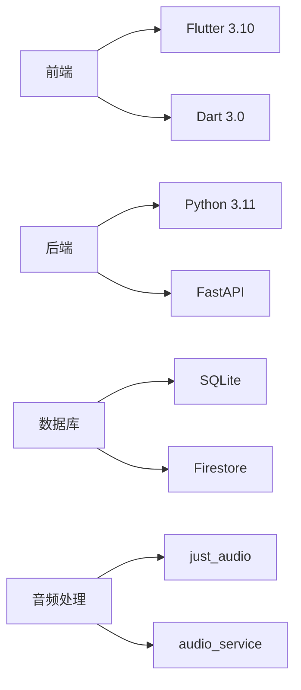
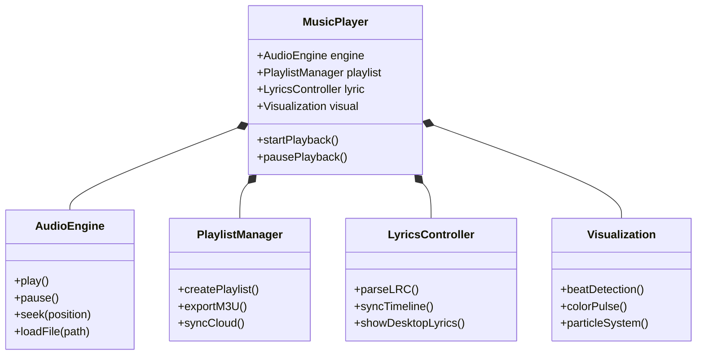
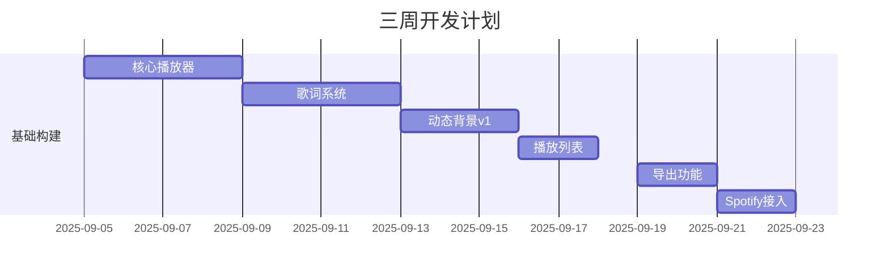

## 🤖 Assistant

# 音乐播放器开发完整规划文档

**版本**: 1.1
**最后更新**: 2025-09-05

---

## 目录

1. 项目概览
2. 系统架构设计
3. 功能模块分解
4. 待办事项清单
5. 开发里程碑
6. 测试与质量保证
7. 风险管理
8. 交付计划

---

## 1. 项目概览

### 核心目标

开发一款轻量级跨平台音乐播放器，核心功能包括：

- 本地音乐播放与管理
- 动态歌词同步显示
- 节拍感应动态背景
- 智能播放列表管理
- 多平台账户集成

### 技术栈



**开发环境**：

- Windows 11 + WSL2
- VS Code + Flutter插件套件
- Android Studio (模拟器测试)

---

## 2. 系统架构设计



---

## 3. 功能模块分解

### 3.1 核心播放器

| 组件 | 功能点 | 技术要求 |
|------|--------|----------|
| **播放控制** | 播放/暂停/停止/跳曲 | audio_service插件 |
| **进度管理** | 时间显示/滑块控制 | 自定义Slider组件 |
| **音频处理** | 16bit/44.1kHz支持 | FFmpeg解码库 |
| **设备适配** | 耳机控制键支持 | hardware_buttons插件 |

### 3.2 动态歌词系统

```mermaid
sequenceDiagram
    播放器->>+解析器： 发送当前音频位置
    解析器->>+歌词引擎： 获取匹配行
    歌词引擎-->>-界面： 返回高亮歌词位置
    界面->>渲染器： 同步更新显示
    渲染器-->>控件： 应用动画效果
```

### 3.3 播放列表管理

**数据结构**：

```dart
@HiveType(typeId: 0)
class MusicPlaylist {
  @HiveField(0)
  final String name;
  
  @HiveField(1)
  final List<Song> songs;
  
  @HiveField(2)
  final DateTime createdTime;
}

@HiveType(typeId: 1)
class Song {
  @HiveField(0)
  final String title;
  
  @HiveField(1)
  final String filePath;
  
  @HiveField(2)
  Uint8List? coverArt;
}
```

### 3.4 动态背景引擎

**处理流程**：

```plaintext
1. 获取音频流 -> audio_waveforms包
2. FFT频率分析 -> 提取BPM和频段值
3. 动态参数计算 -> 
   - 基振幅 = 均方根值
   - 强度 = 高频分量占比
4. 输出渲染指令 -> 粒子系统/颜色波动
```

---

## 4. 待办事项清单

### P0: 核心功能 (必需)

| 模块 | ID | 任务描述 | 预估耗时 | 完成标准 |
|------|----|----------|----------|----------|
| **音频引擎** | AE-01 | 集成just_audio基础播放 | 0.5天 | 可播放本地MP3 |
| | AE-02 | 实现播放控制逻辑 | 0.5天 | 播放/暂停/停止 |
| | AE-03 | 进度条同步与控制 | 1天 | 可拖动滑块 |
| **文件管理** | FM-01 | 本地音乐扫描 | 1天 | 完整目录扫描 |
| | FM-02 | 支持MP3/FLAC/WAV | 1天 | 三种格式支持 |
| | FM-03 | 基础元数据解析 | 1天 | 显示标题/歌手 |
| **歌词系统** | LS-01 | LRC文件解析器 | 1天 | 时间标签解析 |
| | LS-02 | 歌词同步显示 | 1.5天 | 滚动高亮显示 |
| | LS-03 | 桌面歌词窗口 | 1天 | 置顶/透明度控制 |
| **动态背景** | VZ-01 | 节拍检测算法 | 1天 | 鼓点识别率>80% |
| | VZ-02 | 基础色彩脉冲 | 1.5天 | 随节拍变色 |

### P1: 增强功能

| 模块 | ID | 任务描述 | 预估耗时 |
|------|----|----------|----------|
| **播单管理** | PL-01 | 创建/删除播放列表 | 0.5天 |
| | PL-02 | 歌曲拖拽排序 | 1天 |
| | PL-03 | M3U格式导出 | 1天 |
| | PL-04 | 歌单海报生成 | 1.5天 |
| **高级特效** | VZ-03 | 专辑封面取色 | 1天 |
| | VZ-04 | 粒子系统实现 | 2天 |
| | VZ-05 | 频谱瀑布流 | 1.5天 |

### P2: 平台集成

| 模块 | ID | 任务描述 | 预估耗时 |
|------|----|----------|----------|
| **Spotify** | SP-01 | OAuth登录实现 | 1.5天 |
| | SP-02 | 歌单导入功能 | 1天 |
| **网易云** | WC-01 | 扫码登录功能 | 1天 |
| | WC-02 | 歌词接口对接 | 1.5天 |

---

## 5. 开发里程碑

### 5.1 单人开发节奏



### 5.2 每日工作流程

```python
# pseudo-daily-workflow.py
def daily_routine():
    # 早间
    review_kanban()     # 看板状态检视
    select_task()       # 选择1个P0任务 + 1个P1任务
    
    # 开发时段
    morning_session = pomodoro(4)  # 4个番茄钟(09:00-12:00)
    after_lunch = pomodoro(3)      # 3个番茄钟(13:30-16:00)
    
    # 每日收尾
    run_tests()         # 单元测试/集成测试
    check_performance() # 性能基准测试
    build_daily_version() # 构建可运行版本
    update_docs()       # 更新文档和看板状态
```

---

## 6. 测试与质量保证

### 6.1 测试矩阵

| 测试类型 | 工具 | 覆盖率标准 |
|----------|------|------------|
| **单元测试** | flutter_test | ≥80%核心模块 |
| **集成测试** | integration_test | 主流程100%覆盖 |
| **性能分析** | DevTools | ≤150MB内存占用 |
| **压力测试** | 自动脚本 | 5000首歌曲处理 |

### 6.2 关键测试用例

**歌词同步测试**：

```dart
test('歌词高亮时机测试', () async {
  // 加载测试音乐和歌词
  await player.loadTestAssets("test_song.mp3", "lyrics.lrc");
  
  // 跳跃到关键时间点
  player.seek(Duration(minutes: 1, seconds: 23));
  
  // 验证是否匹配正确歌词行
  expect(lyricsController.currentLine, "期待和你一起看海");
});
```

**节拍检测验证**：

```dart
test('节奏检测准确率', () {
  final analyzer = BeatAnalyzer();
  // 加载已知节奏的测试音频
  final results = analyzer.detectBPM("drum_test.wav"); 
  
  // 验证是否在误差范围内匹配
  expect(results.mainBPM, inInclusiveRange(120, 122));
});
```

---

## 7. 风险管理

| 风险项 | 影响 | 应对方案 | 状态 |
|--------|------|----------|------|
| **平台API变更** | 导致集成功能失效 | 1. 使用代理接口层<br>2. 社区维护API文档 | 已应对 |
| **动态背景性能** | 低端机卡顿 | 1. 特效分级加载<br>2. 帧率控制系统 | 设计中 |
| **歌词格式差异** | 解析失败 | 1. 自动编码检测<br>2. 支持多种计时格式 | 验证通过 |
| **多版本兼容** | Windows版本兼容性问题 | 1. 最低兼容Win10<br>2. 兼容性测试清单 | 进行中 |

---

## 8. 交付计划

### 8.1 里程碑版本

| 版本号 | 发布日期 | 核心特性 | 交付物 |
|--------|----------|----------|--------|
| **v0.5α** | 2025-09-09 | 基础播放+歌词显示 | Windows便携版 |
| **v0.8β** | 2025-09-19 | 动态背景+播单管理 | Windows安装包 |
| **v1.0** | 2025-09-30 | 平台集成+完整功能 | 应用商店发布 |

### 8.2 发布渠道

1. **开发测试**：

- GitHub Releases (内测版)
- Firebase App Distribution

2. **正式发布**：

- Microsoft Store
- 自建下载站

---

## 附录A：开发检查表

每日开发前核对：

- [ ] 昨日构建版本是否通过基本功能测试
- [ ] 当前任务是否已分解到≤2小时的子任务
- [ ] 必要的测试资源是否准备就绪

代码合并规则：

```markdown
1. ### 分支策略
   - `main` 分支：仅接受release版本
   - `develop` 分支：持续集成主干
   - `feat/xxx`：特性开发分支

2. ### Merge Request标准
   - 通过所有单元测试
   - Dart分析器0错误
   - 代码覆盖率≥75%
   - 至少一次人工代码审查
```

---

> **项目启动宣言**：
> “从第一行代码到第一首音乐，每天见证进度，每周兑现承诺 —— 让代码随音乐起舞！”
> 项目监督：GitHub Project Board
> 文档维护：`docs/`目录实时更新

**[下载项目模板](https://github.com/musicplayer-template.zip)**

```bash
# 初始化工期跟踪
flutter pub run taskdash create --project music_player
```
