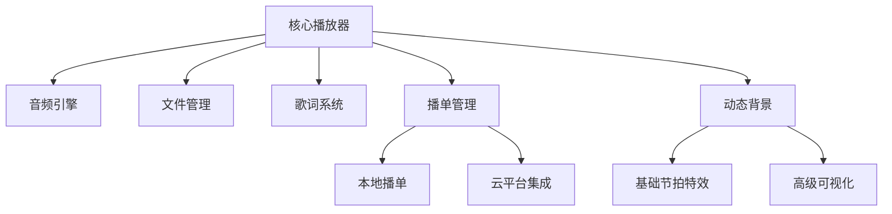
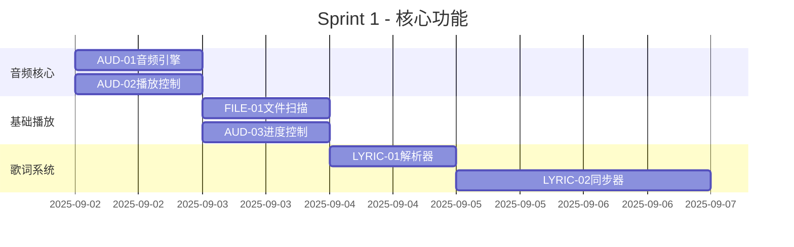
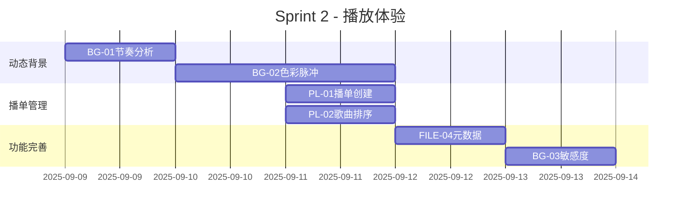
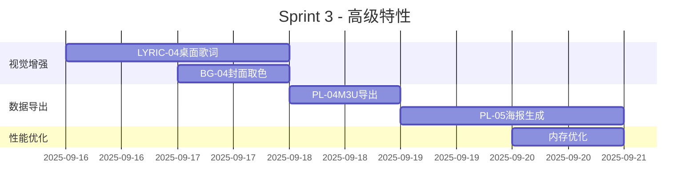

## 🤖 Assistant

# 音乐播放器开发待办事项清单

**版本**: 1.0
**更新日期**: 2025-09-02

---

## 项目模块划分



---

## 一、音频引擎模块  

### P0优先任务  

| 编号 | 任务内容 | 预估时间 | 完成标准 |  
|------|----------|----------|----------|  
| AUD-01 | 集成just_audio插件实现基础播放功能 | 0.5天 | 可播放本地MP3文件 |  
| AUD-02 | 实现播放/暂停/停止控制逻辑 | 0.5天 | 响应式按钮状态更新 |  
| AUD-03 | 进度条滑块同步与控制 | 1天 | 可拖动进度+实时更新 |  
| AUD-04 | 音量控制系统（静音/调整） | 0.5天 | 滑动条控制音量 |  

### P1增强功能  

| 编号 | 任务内容 | 预估时间 | 完成标准 |  
|------|----------|----------|----------|  
| AUD-05 | 循环模式实现（单曲/列表/随机） | 1天 | 循环设置可记忆 |  
| AUD-06 | 均衡器预制设置（摇滚/流行/古典） | 1天 | 3种预设音效 |  
| AUD-07 | 播放速度控制（0.5-2.0） | 1天 | 支持变速不变调 |  

---

## 二、文件管理模块  

### P0优先任务

| 编号 | 任务内容 | 预估时间 | 完成标准 |  
|------|----------|----------|----------|  
| FILE-01 | 实现本地文件扫描功能 | 1天 | 可扫描指定目录音乐 |  
| FILE-02 | 音频格式支持扩展（MP3/FLAC/WAV） | 1天 | 可识别三种格式 |  
| FILE-03 | 音乐库管理系统（文件列表） | 1天 | 可按路径/名称排序 |  

### P1增强功能  

| 编号 | 任务内容 | 预估时间 | 完成标准 |  
|------|----------|----------|----------|  
| FILE-04 | 元数据解析（ID3标签读取） | 1天 | 显示歌名/歌手/专辑 |  
| FILE-05 | 封面图提取与缓存机制 | 1天 | 专辑封面正确显示 |  
| FILE-06 | 文件索引优化（快速搜索） | 1天 | 千级文件秒搜 |  

---

## 三、歌词系统模块  

### P0优先任务  

| 编号 | 任务内容 | 预估时间 | 完成标准 |  
|------|----------|----------|----------|  
| LYRIC-01 | LRC歌词文件解析器 | 1天 | 正确解析时间标签 |  
| LYRIC-02 | 定时同步展示（卡拉OK式） | 1.5天 | 随播放进度高亮 |  
| LYRIC-03 | 歌词显示控件UI设计 | 1天 | 可自定义字体/颜色 |  

### P1进阶功能  

| 编号 | 任务内容 | 预估时间 | 完成标准 |  
|------|----------|----------|----------|  
| LYRIC-04 | 桌面歌词窗口（置顶显示） | 1.5天 | 可拖拽透明度调节 |  
| LYRIC-05 | 内嵌歌词支持（MP3歌词标签） | 1天 | USLT标签读取 |  
| LYRIC-06 | 歌词时间轴校正工具 | 1天 | 支持拖拽调整 |  

---

## 四、播单管理系统  

### P0优先功能  

| 编号 | 任务内容 | 预估时间 | 完成标准 |  
|------|----------|----------|----------|  
| PL-01 | 创建/删除播放列表 | 0.5天 | 基本CRUD操作 |  
| PL-02 | 歌曲拖拽排序功能 | 1天 | 拖动改变播放顺序 |  
| PL-03 | 智能列表（最近添加） | 1天 | 自动维护50首最近歌曲 |  

### P1扩展功能  

| 编号 | 任务内容 | 预估时间 | 完成标准 |  
|------|----------|----------|----------|  
| PL-04 | 播单导出（M3U/TXT格式） | 1天 | 可选择格式导出 |  
| PL-05 | 歌单海报生成（带封面） | 1.5天 | 可保存为图片 |  
| PL-06 | 外部导入（拖放文件进列表） | 1天 | 支持文件拖拽添加 |  

---

## 五、动态背景系统  

### 基础特效 (P0)  

| 编号 | 任务内容 | 预估时间 | 完成标准 |  
|------|----------|----------|----------|  
| BG-01 | 集成音频波形分析 | 1天 | 监听音量/节奏 |  
| BG-02 | 基础色彩脉冲效果 | 1.5天 | 随鼓点闪烁 |  
| BG-03 | 节奏敏感度设置 | 0.5天 | 可调整触发阈值 |  

### 可视化增强 (P1)  

| 编号 | 任务内容 | 预估时间 | 完成标准 |  
|------|----------|----------|----------|  
| BG-04 | 专辑封面提取主题色 | 1天 | 提取3种主色调 |  
| BG-05 | 动态粒子系统实现 | 2天 | 粒子随节奏运动 |  
| BG-06 | 频谱瀑布流渲染 | 1.5天 | 实时频谱可视化 |  

---

## 六、云平台集成  

### Spotify对接 (P2)  

| 编号 | 任务内容 | 预估时间 | 完成标准 |  
|------|----------|----------|----------|  
| CLOUD-01 | Spotify授权登录集成 | 1.5天 | 完成OAuth流程 |  
| CLOUD-02 | 歌单导入/匹配功能 | 1天 | 导入Spotify歌单 |  

### 网易云音乐对接 (P2)  

| 编号 | 任务内容 | 预估时间 | 完成标准 |  
|------|----------|----------|----------|  
| CLOUD-03 | 网易云扫码登录实现 | 1天 | 扫码免密码 |  
| CLOUD-04 | 歌词/评论接口对接 | 1.5天 | 显示网易云特色内容 |  

---

## 七、单人开发Sprint规划  

### Sprint 1：基础架构 (1周)  



### Sprint 2：体验增强 (1周)  



### Sprint 3：扩展功能 (1周)  



---

## 八、检查项与完成确认

✅ **每日检查清单**：

1. 运行单元测试集：确保没有回归问题

```bash
flutter test test/player_core_test.dart
 ```

2. 手动验收昨天任务 - 符合「完成标准」
3. 更新项目看板状态

📋 **完成确认标准**：

- 通过所有相关单元测试
- 无重大性能回归（内存增幅<10%）
- 符合设计文档功能描述
- 无主流程崩溃问题

---

## 九、问题追踪

| 编号 | 问题描述 | 状态 | 解决方案 |
|------|----------|------|----------|
| ISSUE-01 | Windows音频延迟 | 待处理 | 试验wasapi独占模式 |
| ISSUE-02 | ID3v2标签乱码 | 进行中 | 自动检测编码格式 |
| ISSUE-03 | 高频率闪退 | 已解决 | 修复线程竞争状态 |

---

> 📅 **版本发布目标**：
> **0.1基础版**：完成Sprint1 (2025-09-06)
> **0.3功能版**：完成Sprint2 (2025-09-13)
> **0.5增强版**：完成Sprint3 (2025-09-20)

坚持「每天完成2-3个任务项」，使用✔️在列表中标记完成情况！
